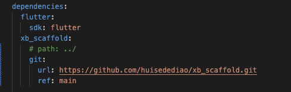

<!--
This README describes the package. If you publish this package to pub.dev,
this README's contents appear on the landing page for your package.

For information about how to write a good package README, see the guide for
[writing package pages](https://dart.dev/guides/libraries/writing-package-pages).

For general information about developing packages, see the Dart guide for
[creating packages](https://dart.dev/guides/libraries/create-library-packages)
and the Flutter guide for
[developing packages and plugins](https://flutter.dev/developing-packages).
-->

基于provider封装的脚手架，集成路由、主题、dialog、toast、actionSheet等功能

## 引入
在pubspec.yaml中添加引用：
```
  xb_scaffold:
    git:
      url: https://github.com/huisedediao/xb_scaffold.git
      ref: main
```


## 初始化
```
void main() async {
  /// 传入不同主题的图片路径
  await initXBScaffold(
      imgPrefixs: ["assets/images/default/", "assets/images/custom/"]);
  runApp(const MyApp());
}
```

## 使用

### 主题切换
```
/// 这里的序号，对应initXBScaffold传入的图片路径的序号
XBThemeVM().changeTheme(1);
```

### mixin
##### XBSysSpaceMixin
```
一些系统的参数，比如屏幕宽高、状态栏高度、navigationBar高度、
tabbar高度、一个像素的高度等等
```
##### XBOperaMixin
```
一些页面操作，比如push、pop，比如结束输入框编辑
```

##### XBThemeMixin
```
和主题相关的参数，包括颜色、字体、字重、图片、间距
```

### XBStatelessWidget
```
和StatelessWidget一样使用

在StatelessWidget的基础上，增加了XBThemeMixin
```

### XBState
```
和State一样使用

在State的基础上，增加了XBSysSpaceMixin，XBThemeMixin，XBOperaMixin三个mixin
```
### XBVM
```
继承自ChangeNotifier

增加了XBSysSpaceMixin，XBThemeMixin，XBOperaMixin三个mixin

用于页面状态的管理

构造时需传入其管理的页面的context，用于在vm中处理业务
```

### XBWidget
```
基于provider和XBVM封装的widget，简化provider的使用

抽象类，重写buildWidget进行UI的编写


示例：

class XBWidgetTest extends XBWidget<XBWidgetTestVM> {
  const XBWidgetTest({super.key});

  @override
  XBWidgetTestVM generateVM(BuildContext context) {
    return XBWidgetTestVM(context: context);
  }

  @override
  Widget buildWidget(XBWidgetTestVM vm, BuildContext context) {
    return Container();
  }
}

class XBWidgetTestVM extends XBVM<XBWidgetTest> {
  XBWidgetTestVM({required super.context});
}
```

### XBVMLessWidget
```
继承自XBWidget，使用XBVM作为默认vm

不需要自己写vm，适合不需要处理业务逻辑只需要UI的情况
```

### XBPage
```
抽象类，继承自XBWidget

封装了navigationBar（可隐藏）的页面，可定制标题、返回按钮、右上角按钮、
背景颜色、navigationBar背景颜色等等

提供是否屏幕方向改变后重新build、是否启动安卓物理返回、是否需要输入框跟随键盘移动、是否启动iOS侧滑返回等功能选择


示例：

class XBPageTest extends XBPage<XBPageTestVM> {
  const XBPageTest({super.key});

  @override
  XBPageTestVM generateVM(BuildContext context) {
    return XBPageTestVM(context: context);
  }

  @override
  Widget buildPage(XBPageTestVM vm, BuildContext context) {
    return Container();
  }
}

class XBPageTestVM extends XBVM<XBPageTest> {
  XBPageTestVM({required super.context});
}
```

### 路由
```
使用VM中mixin的push、replace、pop

示例：

要跳转到NewPage，

在VM子类中和XBState子类中使用：
push(NewPage());

在XBWidget子类中使用：
vm.push(NewPage());
```

### XBVMToast\XBVMDialog\XBVMActionSheet
```
为XBVM增加toast、dialog、actionSheet
```

### 拓展主题中没有的内容

```
使用extension向对应的类中添加即可。


例如，要添加颜色：

extension AppThemeColor on XBThemeColor {
  Color get orange => Colors.orange;
}
```

